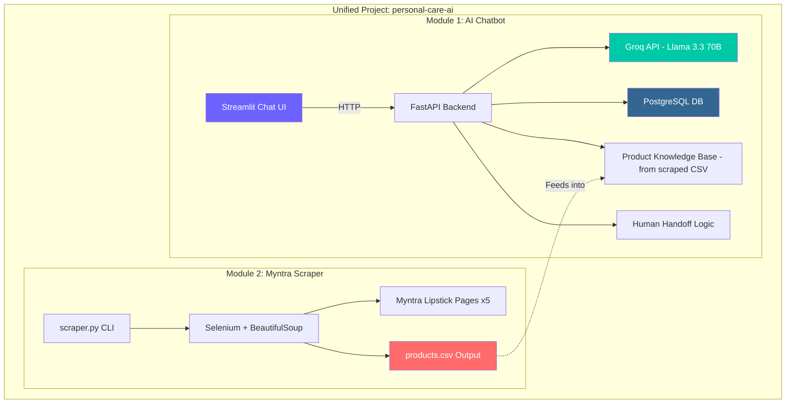

# Personal Care AI Chatbot & Myntra Product Scraper

A unified Python project for an AI Engineer assignment — combining an LLM-powered product chatbot with an e-commerce data scraper.

---

## Project Overview

| Aspect | Detail |
|---|---|
| **LLM Provider** | Groq API (free tier) — `llama-3.3-70b-versatile` |
| **Database** | PostgreSQL (local) |
| **Backend** | FastAPI |
| **Frontend** | Streamlit (impressive chat UI with minimal effort) |
| **Scraping** | Selenium + BeautifulSoup + pandas |
| **Language** | Python 3.10+ |

---

## User Review Required

> [!IMPORTANT]
> **Groq API Key** — You need a free API key from [console.groq.com/keys](https://console.groq.com/keys). Do you already have one, or do you need help creating it?

> [!IMPORTANT]
> **PostgreSQL** — Do you have PostgreSQL installed on your laptop? If not, I'll include installation steps (or we can use a Docker container, or a free cloud instance like Neon/Supabase).

> [!WARNING]
> **Chrome/ChromeDriver** — The Myntra scraper needs Google Chrome installed. Do you have Chrome on your laptop?

---

## Architecture



---

## Proposed Project Structure

```
c:\Users\suraj\OneDrive\Documents\DocEx\
├── .env                          # API keys & DB credentials
├── .gitignore
├── requirements.txt
├── README.md                     # Professional documentation
│
├── config/
│   └── settings.py               # Centralized config (reads .env)
│
├── database/
│   ├── __init__.py
│   ├── connection.py             # PostgreSQL connection + engine
│   ├── models.py                 # SQLAlchemy ORM models
│   └── seed.py                   # Generate sample data
│
├── chatbot/
│   ├── __init__.py
│   ├── groq_client.py            # Groq API wrapper
│   ├── prompt_templates.py       # System prompts & templates
│   ├── product_kb.py             # Load CSV into knowledge base
│   └── handoff.py                # Human handoff detection logic
│
├── scraper/
│   ├── __init__.py
│   ├── myntra_scraper.py         # Selenium scraper for Myntra
│   └── export.py                 # CSV export utilities
│
├── api/
│   ├── __init__.py
│   ├── main.py                   # FastAPI app entry point
│   ├── routes/
│   │   ├── chat.py               # POST /chat endpoint
│   │   └── products.py           # GET /products endpoint
│   └── schemas.py                # Pydantic request/response models
│
├── ui/
│   └── streamlit_app.py          # Streamlit chat interface
│
├── data/
│   └── products.csv              # Scraped output (generated)
│
└── sample_data/
    └── sample_conversations.json # Pre-generated sample data
```

---

## Proposed Changes (Phase by Phase)

### Phase 1: Project Setup & Configuration

#### [NEW] requirements.txt
All dependencies: `groq`, `fastapi`, `uvicorn`, `sqlalchemy`, `psycopg2-binary`, `python-dotenv`, `streamlit`, `selenium`, `beautifulsoup4`, `pandas`, `webdriver-manager`, `pydantic`

#### [NEW] .env
Template for `GROQ_API_KEY`, `DATABASE_URL`, and contact number for human handoff.

#### [NEW] .gitignore
Standard Python gitignore + `.env`

#### [NEW] config/settings.py
Reads `.env` using `python-dotenv`. Centralizes all config constants.

---

### Phase 2: PostgreSQL Database Layer

#### [NEW] database/connection.py
- SQLAlchemy engine and `SessionLocal` factory
- `get_db()` dependency for FastAPI
- Auto-create tables on startup

#### [NEW] database/models.py
Two ORM models:
1. **`Conversation`** — `id`, `session_id`, `created_at`
2. **`Message`** — `id`, `conversation_id` (FK), `role` (user/assistant/system), `content`, `timestamp`

This stores the full back-and-forth between the user and the AI, satisfying the "store AI and user-related conversations" requirement.

#### [NEW] database/seed.py
Script to generate 3-5 sample conversations with realistic personal care questions and AI responses, inserted into the DB to prove the workflow works end-to-end.

---

### Phase 3: Myntra Web Scraper (Task 2)

#### [NEW] scraper/myntra_scraper.py
- Uses `Selenium` with `webdriver-manager` (auto-downloads ChromeDriver)
- Navigates to `https://www.myntra.com/personal-care?f=Categories%3ALipstick`
- Scrolls and paginates through up to **5 pages**
- For each product card, extracts:
  - **Product Name** (brand + title)
  - **Price** (discounted price + MRP)
  - **Discount %**
  - **Rating & Review Count**
  - **Product URL** (full link)
  - **Breadcrumb** (e.g., `Home / Personal Care / Lipstick`)
  - **Image URL**
- Handles anti-bot measures with `undetected-chromedriver` or randomized delays
- Runs in **headless mode** (no browser window visible)

#### [NEW] scraper/export.py
- Takes the list of scraped product dicts
- Exports to `data/products.csv` using pandas
- Prints summary statistics (total products, price range, etc.)

---

### Phase 4: AI Chatbot (Task 1)

#### [NEW] chatbot/groq_client.py
- Initializes `Groq` client with API key
- `get_chat_response(messages, product_context)` — sends the conversation history + relevant product context to Groq's `llama-3.3-70b-versatile` model
- Handles streaming responses for the UI

#### [NEW] chatbot/prompt_templates.py
System prompt that instructs the LLM to:
1. Act as a **personal care product expert**
2. Answer questions about lipstick products using the scraped data as context
3. Provide grooming/beauty advice (general knowledge)
4. **Detect** queries about offers, returns, complaints → trigger human handoff
5. Be friendly and professional

#### [NEW] chatbot/product_kb.py
- Loads `data/products.csv` into memory
- Performs basic **keyword search** to find relevant products when the user asks about specific items
- Formats matched products as context for the LLM prompt

#### [NEW] chatbot/handoff.py
- Contains a list of **trigger keywords/phrases**: "return", "refund", "complaint", "offer", "discount code", "exchange", "cancel order", "speak to human", etc.
- `check_handoff(user_message)` → returns `True` + a formatted handoff message with the contact number if triggered

---

### Phase 5: FastAPI Backend

#### [NEW] api/schemas.py
Pydantic models: `ChatRequest` (message, session_id), `ChatResponse` (reply, is_handoff, products_referenced)

#### [NEW] api/routes/chat.py
`POST /api/chat`:
1. Receive user message + session_id
2. Check `handoff.py` — if triggered, return handoff response
3. Search `product_kb.py` for relevant products
4. Fetch conversation history from PostgreSQL
5. Build message list (system + history + product context + user message)
6. Call `groq_client.py` → get response
7. Save both user message and AI response to PostgreSQL
8. Return response

#### [NEW] api/routes/products.py
`GET /api/products` — returns the product CSV data as JSON (for dashboard/reference)

#### [NEW] api/main.py
FastAPI app with CORS, startup event (create tables + load product KB), and route includes.

---

### Phase 6: Streamlit Chat UI

#### [NEW] ui/streamlit_app.py
A polished Streamlit chat interface with:
- Chat message bubbles (using `st.chat_message`)
- Session management (new conversation / continue)
- Real-time display of AI responses
- Visual indicator when human handoff is triggered (warning banner with contact number)
- Sidebar showing connected product database stats
- "Powered by Groq + Llama 3.3" branding

---

### Phase 7: Documentation & Sample Data

#### [NEW] README.md
Professional README with:
- Project overview and architecture diagram
- Setup instructions (step-by-step)
- Screenshots
- Tech stack table
- How to run each component

#### [NEW] sample_data/sample_conversations.json
Pre-built sample conversations demonstrating:
1. A user asking about lipstick products → AI responds with product info
2. A user asking about grooming benefits → AI gives advice
3. A user asking about returns → human handoff triggered

---

## Open Questions

> [!IMPORTANT]
> 1. **Do you have PostgreSQL installed?** If not, would you prefer:
>    - Local PostgreSQL installation
>    - Docker container (`docker run postgres`)
>    - Free cloud DB (Neon / Supabase — zero install)
>
> 2. **Do you have a Groq API key?** (Free at [console.groq.com/keys](https://console.groq.com/keys))
>
> 3. **Myntra Scraping** — Myntra is heavily JS-rendered and has anti-bot protections. If the live scraper gets blocked, I'll generate **realistic sample data** that mimics what the scraper would have collected, so the chatbot still works end-to-end. Is that acceptable?
>
> 4. **Customer service contact number** — What phone number should the chatbot provide during human handoff? (I'll use a placeholder like `1800-XXX-XXXX` for now)

---

## Verification Plan

### Automated Tests
1. **Scraper**: Run `python -m scraper.myntra_scraper` → verify `data/products.csv` is generated with correct columns
2. **Database**: Run `python -m database.seed` → verify sample data appears in PostgreSQL
3. **API**: Start FastAPI with `uvicorn api.main:app` → test endpoints using browser/curl
4. **Chatbot E2E**: Send test messages through the API:
   - Product query → should return relevant product info
   - General grooming question → should return helpful advice
   - "I want to return my order" → should trigger human handoff

### Manual Verification
1. **Streamlit UI**: Run `streamlit run ui/streamlit_app.py` → have a full conversation
2. **CSV Output**: Open `data/products.csv` in Excel → verify all required fields are present
3. **PostgreSQL**: Connect with `psql` or pgAdmin → verify conversations are stored

---

## Timeline (2-Day Plan)

| Day | Task | Hours |
|-----|------|-------|
| **Day 1 AM** | Phase 1 (Setup) + Phase 2 (Database) | ~2h |
| **Day 1 PM** | Phase 3 (Scraper) + Phase 4 (Chatbot core) | ~4h |
| **Day 2 AM** | Phase 5 (FastAPI) + Phase 6 (Streamlit UI) | ~4h |
| **Day 2 PM** | Phase 7 (Docs) + Testing + Polish | ~2h |
